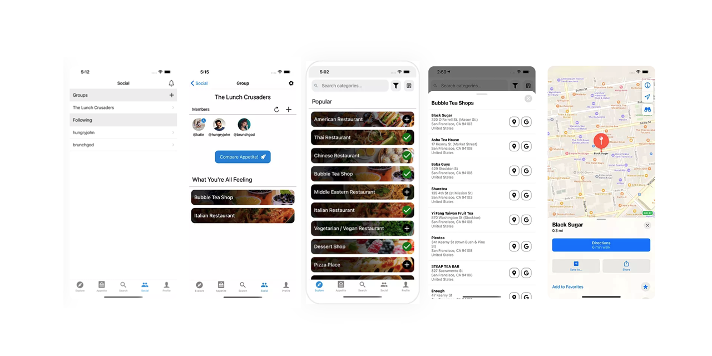

[](./banner.png)

# mealmatch-app

Mobile application to help friends answer the question "what do you want to eat?"

## Getting Started

Prerequisites:
- Node.js v10.x or later
- npm v5.x or later


1.  Install the [Expo CLI](https://github.com/garygcchiu/mealmatch-app.git): 

    ```bash
    npm install -g expo-cli
    ```

2. Install dependencies:

    ```bash
    npm i
    ```


## About

- AWS Amplify used to power [social sign-in and basic auth](https://docs.amplify.aws/lib/auth/getting-started/q/platform/js) 
- Navigation implemented using [React Navigation](https://reactnavigation.org/)
- React Contexts API used to maintain global state
